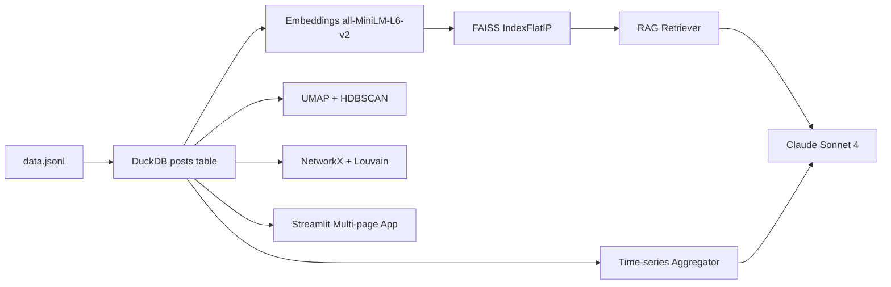

# NarrativeScope

NarrativeScope is a Streamlit-based social media narrative intelligence platform that analyzes how narratives spread across politically diverse Reddit communities. It combines semantic retrieval, clustering, network analysis, and AI-assisted summaries in a single dashboard.

## Publicly Hosted Web Platform

- Live URL: https://YOUR-APP-NAME.streamlit.app

## Screenshots

Replace these files with your final screenshots in `docs/screenshots/`.

### 1. Landing Page


### 2. Overview Dashboard


### 3. Timeline Analysis


### 4. Network Explorer


### 5. AI Chat Assistant


## Key Features

- Multi-page Streamlit app for Overview, Timeline, Network, Clusters, and Chat.
- Semantic search on Reddit post text using embeddings + FAISS.
- Topic clustering using UMAP + HDBSCAN/KMeans.
- Subreddit relationship graph with PageRank, betweenness, and Louvain communities.
- AI assistant for exploratory questions with graceful fallback when LLM service is unavailable.

## Architecture



## ML/AI Stack

- Embeddings: `all-MiniLM-L6-v2` (384-dimensional)
- Vector index: FAISS `IndexFlatIP`
- Dimensionality reduction: UMAP (`metric=cosine`)
- Clustering: HDBSCAN (auto) or KMeans (manual)
- Network metrics: PageRank + Betweenness (`networkx`)
- Community detection: Louvain (`python-louvain`)
- LLM provider: Anthropic Claude Sonnet

## Repository Structure

```text
.
├── app.py                  # Streamlit app entrypoint
├── shared.py               # Cached data/index/network loaders
├── ui.py                   # Shared responsive UI styles
├── pages/                  # Streamlit multipage views
├── backend/                # Data loading + ML + LLM modules
├── render.yaml             # Render deployment config
└── Procfile                # Process startup command
```

## Local Setup

1. Clone the repository and move into the project directory.
2. Create and activate a virtual environment.
3. Install dependencies.
4. Add environment variables.
5. Run Streamlit.

```bash
python -m venv .venv
source .venv/Scripts/activate
pip install -r requirements.txt
cp backend/.env.example .env
streamlit run app.py
```

Open: http://localhost:8501

## Required Environment Variables

```env
ANTHROPIC_API_KEY=your_key_here
DATA_PATH=./backend/data.jsonl
DB_PATH=./narrativescope.db
INDEX_PATH=./embeddings.index
ID_MAP_PATH=./id_map.pkl
```

## Deployment Guide

### Option A: Streamlit Community Cloud

1. Open Streamlit Community Cloud: https://share.streamlit.io/
2. Click **Create app** and select repository:
  - Repository: `shiven365/research-engineering-intern-assignment`
  - Branch: `main`
  - Main file path: `app.py`
3. Open **Advanced settings** and set Python version to `3.11`.
4. In **Secrets**, paste values from `.streamlit/secrets.toml.example`.
5. Click **Deploy**.

After deployment, replace the placeholder URL in the **Publicly Hosted Web Platform** section with your live app URL.

### Option B: Render

1. Create a new web service from this repository.
2. Render will detect `render.yaml`.
3. Set `ANTHROPIC_API_KEY` in environment variables.

## Notes

- First run may take longer while embeddings and index files are generated.
- Chat mode includes local fallback responses if external LLM credits are unavailable.
