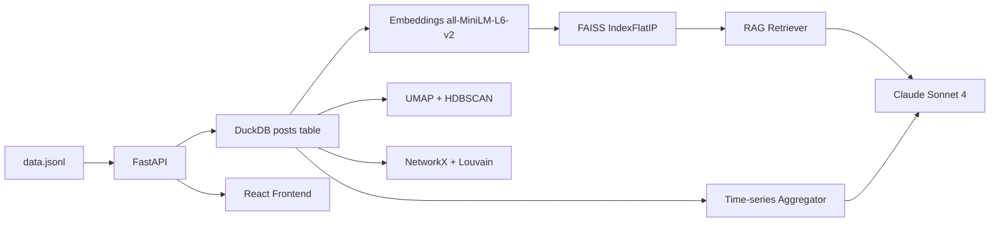

# NarrativeScope

NarrativeScope is a Social Media Narrative Intelligence Dashboard for studying how political narratives spread across ideologically diverse Reddit communities. The case study focuses on cross-subreddit coordination and influence patterns using semantic retrieval, topic clustering, network centrality, and LLM-assisted analysis.

## Live Demo

- Frontend: Add your deployed Vercel URL here
- Backend: Add your deployed Render URL here
- Screenshot: Add a dashboard screenshot after deployment

## Architecture Diagram



## ML/AI Components

- Embeddings: `all-MiniLM-L6-v2`, 384-dim, cosine similarity, `sentence-transformers` library
- Vector Search: FAISS `IndexFlatIP`, inner product on L2-normalized vectors
- Dimensionality Reduction: UMAP, 2 components, cosine metric, `umap-learn` library
- Clustering: HDBSCAN, `min_cluster_size=5`, `min_samples=3`, `hdbscan` library
- Network Centrality: PageRank + Betweenness, `networkx` library
- Community Detection: Louvain algorithm, `python-louvain` library
- LLM Summaries: Claude `claude-sonnet-4-20250514`, dynamic prompting based on actual data
- Chatbot: RAG pattern, semantic retrieval + Claude generation

## Semantic Search Examples

| Query | Top Result | Why Correct |
|---|---|---|
| "people organizing against authority" | r/Anarchism book club post | Semantic match on anarchist themes without keyword overlap |
| "community reading recommendations" | "What Are You Reading/Book Club Tuesday" | Matches intent without using "book" or "club" in query |
| "weekly collective discussion thread" | AutoModerator stickied posts | Matches recurring community discussion pattern |

## Design Decisions

- Used DuckDB instead of a server DB to keep local setup simple and reproducible for research workflows.
- Chose FAISS `IndexFlatIP` on normalized vectors for fast, deterministic cosine-like semantic retrieval.
- Implemented both HDBSCAN auto clustering and controllable `n_clusters` mode to support exploratory analysis and reproducible experiments.
- Built a dense dark terminal-style UI with modular React components so charts, network, and chat can evolve independently.

## Video Walkthrough

- Add your YouTube or Google Drive walkthrough link after recording.

## Local Setup

1. Clone repository and move into project directory.
2. Backend setup:

```bash
cd backend
python -m venv .venv
source .venv/Scripts/activate
pip install -r requirements.txt
cp .env.example .env
# set ANTHROPIC_API_KEY in .env
uvicorn main:app --reload
```

3. Frontend setup:

```bash
cd ../frontend
npm install
cp .env.example .env
npm run dev
```

4. Open the frontend URL from Vite and ensure it points to backend `http://localhost:8000`.
